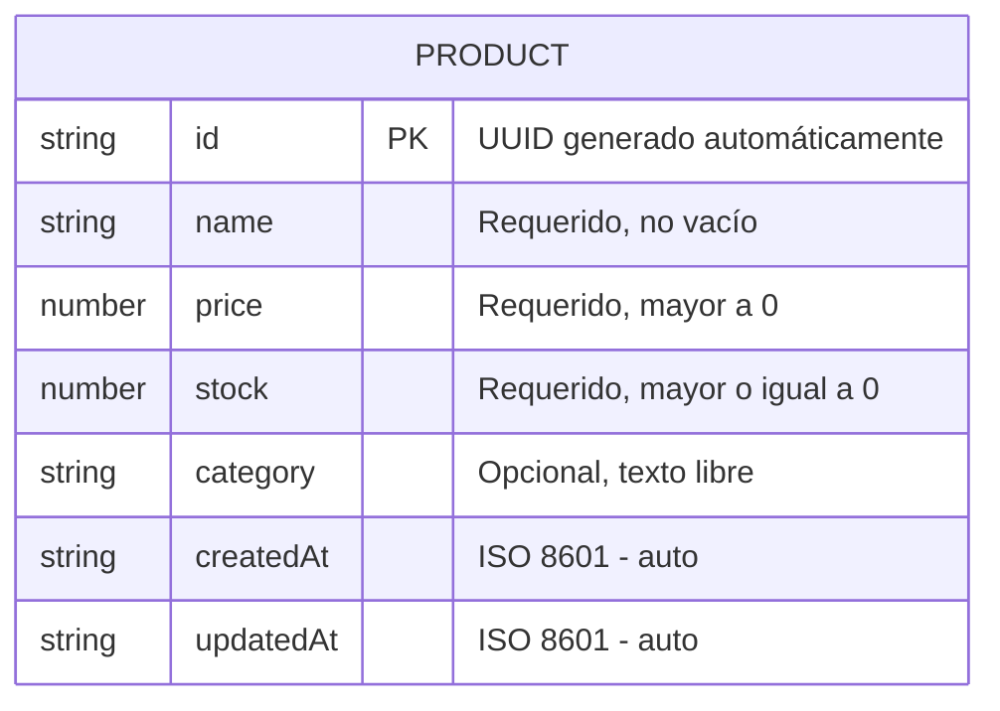

# Data Model — Inventory API

---

## Entidad: Product

Única entidad del sistema. Representa un producto en el inventario del emprendedor.

| Campo | Tipo | Requerido | Validación | Descripción |
|---|---|---|---|---|
| `id` | string (UUID) | Sí (auto) | — | Identificador único del producto |
| `name` | string | Sí | No vacío | Nombre del producto |
| `price` | number | Sí | > 0 | Precio unitario del producto |
| `stock` | number | Sí | >= 0 | Cantidad disponible en inventario |
| `category` | string | No | Texto libre | Categoría del producto (ej: "ropa", "electrónica") |
| `createdAt` | string (ISO 8601) | Sí (auto) | — | Fecha y hora de creación |
| `updatedAt` | string (ISO 8601) | Sí (auto) | — | Fecha y hora de última modificación |

---

## Diagrama



---

## Reglas de Negocio

- `price` debe ser mayor a 0. No se aceptan productos gratuitos ni con precio negativo.
- `stock` no puede ser negativo. Si una actualización de stock deja el resultado por debajo de 0, se rechaza con 400.
- `category` es texto libre — el usuario escribe lo que quiera (ej: "bebidas", "calzado").
- `id`, `createdAt` y `updatedAt` son generados automáticamente por el servidor.
- El almacenamiento es **en memoria** (array). Los datos no persisten entre reinicios.

---

## Ejemplo de objeto Product

```json
{
  "id": "b2c3d4e5-f6a7-8901-bcde-f12345678901",
  "name": "Polo básico blanco",
  "price": 25.00,
  "stock": 40,
  "category": "ropa",
  "createdAt": "2025-06-25T14:15:00.000Z",
  "updatedAt": "2025-06-25T14:15:00.000Z"
}
```
